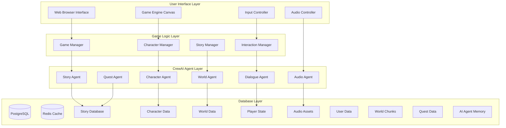

# 🏰 Magic Adventure Game - System Architecture
**Document Version:** v2.0.0  
**Created:** September 4, 2025 - 2:15 PM UTC  
**Last Updated:** September 4, 2025 - 2:30 PM UTC  
**Updated By:** Architecture Integration Agent

## Conceptual Architecture



## Logical Architecture

### 1. Frontend Web Application
```
┌─────────────────────────────────────┐
│           Game Canvas               │
├─────────────────────────────────────┤
│  ┌─────────┐ ┌─────────┐ ┌────────┐ │
│  │Character│ │ Story   │ │ Audio  │ │
│  │Renderer │ │Overlay  │ │Engine  │ │
│  └─────────┘ └─────────┘ └────────┘ │
├─────────────────────────────────────┤
│        Input Event Handlers        │
├─────────────────────────────────────┤
│          State Management          │
└─────────────────────────────────────┘
```

### 2. CrewAI Agent System
```
┌─────────────────────────────────────┐
│          Agent Orchestrator         │
├─────────────────────────────────────┤
│  Story    Character   World   Quest │
│  Agent  →  Agent   →  Agent → Agent │
│    ↓        ↓         ↓       ↓    │
│ Dialogue ← Audio ← Interaction ←──┘ │
│  Agent     Agent     Manager       │
└─────────────────────────────────────┘
```

### 3. Data Flow Architecture
```
Player Action → Input Handler → Game Manager → CrewAI Agents → 
Response Generation → UI Update → Character Animation → Audio Feedback
```

## Component Details

### Frontend Components
- **Game Engine**: HTML5 Canvas with WebGL support
- **Character System**: Sprite-based 2D characters with movement
- **Audio System**: Web Audio API for ambient sounds and character interactions
- **UI Framework**: Modern responsive design with touch support

### CrewAI Agent Specializations
- **Story Agent**: Generates narrative content and plot progression
- **Character Agent**: Manages character personalities and behaviors
- **World Agent**: Creates environmental descriptions and world-building
- **Dialogue Agent**: Generates dynamic conversations and responses
- **Quest Agent**: Creates and manages side quests and objectives
- **Audio Agent**: Coordinates sound effects and ambient audio

### Technical Stack
- **Frontend**: HTML5, CSS3, JavaScript ES6+, Canvas API
- **AI Integration**: CrewAI Python backend with REST API
- **Audio**: Web Audio API, HTML5 Audio elements
- **Graphics**: 2D sprites, CSS animations, canvas rendering
- **State Management**: Local storage, session management
- **Communication**: WebSocket for real-time AI responses

## Performance Considerations
- **Lazy Loading**: Stories and assets loaded on demand
- **Caching**: AI responses cached for repeated interactions
- **Optimization**: Sprite batching, audio compression
- **Scalability**: Modular agent system for easy expansion